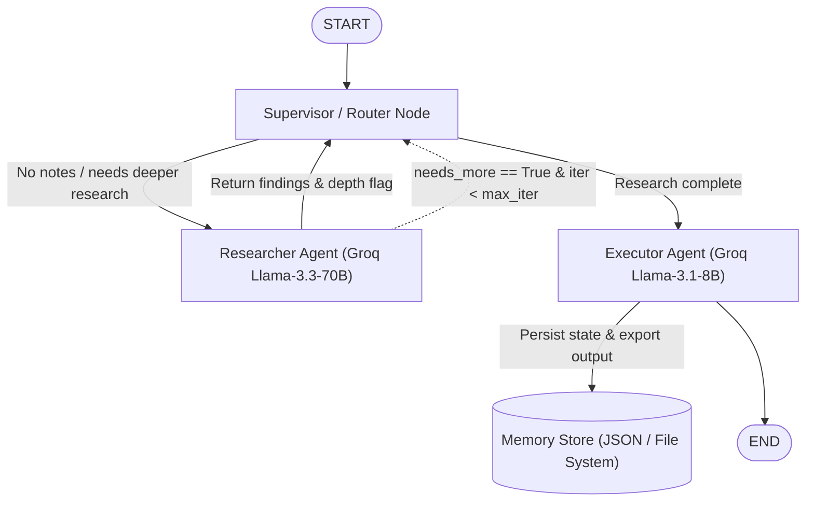
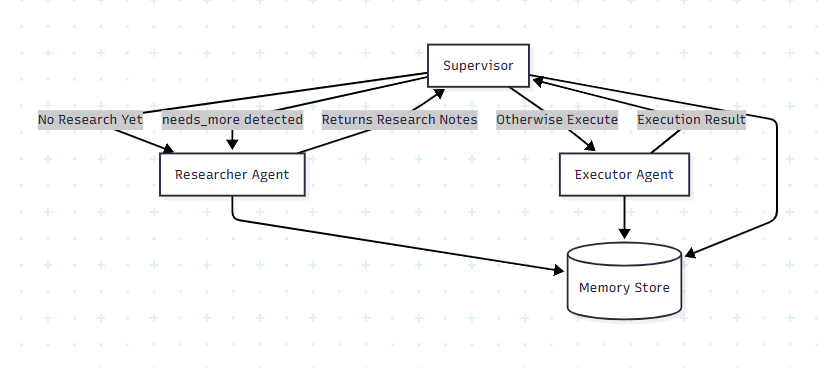
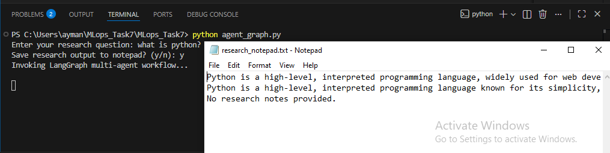

# Autonomous Multi-Agent Research System (LangGraph + Groq)

[](https://www.python.org/downloads/)
[](https://github.com/langchain-ai/langgraph)
[](https://groq.com/)

An autonomous multi-agent research workflow powered by **LangGraph**, **Groq LLMs (Llama 3.3 70B & Llama 3.1 8B)**, state persistence, and automated note execution. This repository demonstrates production-grade agentic AI patterns including supervisor routing, iterative reflection loops, memory persistence, and system file integration.

---

## 🌟 Key Features

- **Supervisor-Worker Agent Architecture**: Central supervisor/router node dynamically routes tasks based on query evaluation and current state.
- **High-Performance LLM Reasoning (Groq)**:
  - **Researcher Agent**: Powered by `llama-3.3-70b-versatile` for deep information synthesis and factual research.
  - **Executor Agent**: Powered by `llama-3.1-8b-instant` for ultra-fast JSON structured output formatting.
- **Autonomous Feedback & Iteration Loops**: Automatically evaluates whether current research notes satisfy depth criteria (`needs_more: true/false`) and loops back to research until completion or iteration limit.
- **Stateful Memory & Checkpointing**:
  - Durable JSON memory store (`langgraph_memory.json`) persisting context across workflow executions.
  - LangGraph `InMemorySaver` checkpointer supporting session thread tracking.
- **Automated Output Integration**: Structured summaries are saved to file system artifacts (`research_notepad.txt` / `results.txt`) with desktop Notepad auto-launch support on Windows environments.

---

## 📐 System Architecture



### Architecture Overview Diagram


---

## 📁 Repository Structure

```
.
├── agent_graph.py           # Core LangGraph implementation (Supervisor, Researcher, Executor, Persistence)
├── multiagent_agents.py     # Modular Agent node functions (Research & Execution routines)
├── multiagent_supervisor.py # Supervisor routing logic
├── multiagent_app.py        # Interactive CLI application with LangGraph checkpointer
├── state.py                 # Dataclass ProjectState schema definition
├── requirements.txt         # Project dependencies
├── .gitignore               # Git exclusion rules
├── Graph.PNG                # Architecture flowchart visual
└── output.PNG               # Execution visual & notepad output screenshot
```

---

## 🚀 Getting Started

### Prerequisites

- Python 3.10 or higher
- Groq API Key (Sign up at [console.groq.com](https://console.groq.com/))

### Installation

1. **Clone the Repository**:
   ```bash
   git clone https://github.com/Janaymn/langgraph-multiagent-researcher.git
   cd langgraph-multiagent-researcher
   ```

2. **Create and Activate Virtual Environment**:
   ```bash
   # Windows (PowerShell)
   python -m venv venv
   .\venv\Scripts\Activate.ps1

   # Linux / macOS
   python3 -m venv venv
   source venv/bin/activate
   ```

3. **Install Dependencies**:
   ```bash
   pip install -r requirements.txt
   ```

4. **Set API Key**:
   ```bash
   # Windows PowerShell
   $env:GROQ_API_KEY="your_groq_api_key_here"

   # Windows CMD
   set GROQ_API_KEY=your_groq_api_key_here

   # Linux / macOS
   export GROQ_API_KEY=your_groq_api_key_here
   ```

---

## 💡 Usage

### Option 1: Running the Complete Groq LangGraph Graph (`agent_graph.py`)

Run the autonomous agent graph with Groq LLM reasoning:

```bash
python agent_graph.py
```

**Workflow Prompt Steps**:
1. Enter your research query (e.g. *"What are the latest advancements in Quantum Computing?"*).
2. Choose whether to automatically open and save findings to Notepad (`y/n`).
3. View real-time agent invocation logs, aggregated research notes, and Mermaid graph syntax.

### Option 2: Running the Interactive Demo (`multiagent_app.py`)

Run the modular multi-agent workflow powered by state checkpoints:

```bash
python multiagent_app.py
```

---

## 📸 Output & Execution Screenshots

### Output Visual Demonstration


---

## 🛠 Tech Stack

- **Framework**: [LangGraph](https://github.com/langchain-ai/langgraph) / [LangChain](https://github.com/langchain-ai/langchain)
- **LLM Engine**: [Groq Cloud SDK](https://console.groq.com/) (Llama-3.3-70b-versatile, Llama-3.1-8b-instant)
- **State Management**: Python `TypedDict`, `dataclasses`, JSON persistence
- **Language**: Python 3.10+

---
